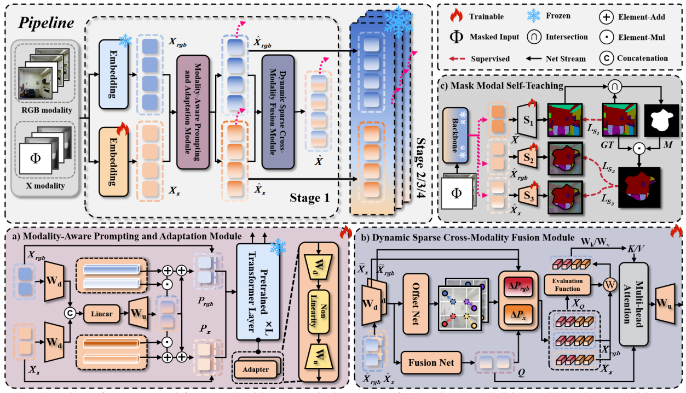

<div align="center"> 

## Keep the Balance: A Parameter-Efficient Symmetrical Framework for RGB+X Semantic Segmentation 
## 🌟CVPR 2025 (Oral Presentation)🌟
Jiaxin Cai, Jingze Su, Qi Li, Wenjie Yang, Shu Wang, Tiesong Zhao, Shengfeng He, Wenxi Liu
</div>


## Abstract

Multimodal semantic segmentation is a critical challenge in computer vision, with early methods suffering from high computational costs and limited transferability due to full fine-tuning of RGB-based pre-trained parameters. Recent studies, while leveraging additional modalities as supplementary prompts to RGB, still predominantly rely on RGB, which restricts the full potential of other modalities. To address these issues, we propose a novel symmetric parameter-efficient fine-tuning framework for multimodal segmentation, featuring with a modality-aware prompting and adaptation scheme, to simultaneously adapt the capabilities of a powerful pre-trained model to both RGB and X modalities. Furthermore, prevalent approaches use the global cross-modality correlations of attention mechanism for modality fusion, which inadvertently introduces noise across modalities. To mitigate this noise, we propose a dynamic sparse cross-modality fusion module to facilitate effective and efficient cross-modality fusion. To further strengthen the above two modules, we propose a training strategy that leverages accurately predicted dual-modality results to self-teach the single-modality outcomes. In comprehensive experiments, we demonstrate that our method outperforms previous state-of-the-art approaches across six multimodal segmentation scenarios with minimal computation cost.

For more details, please check [our paper.](https://openaccess.thecvf.com/content/CVPR2025/papers/Cai_Keep_the_Balance_A_Parameter-Efficient_Symmetrical_Framework_for_RGBX_Semantic_CVPR_2025_paper.pdf)

For questions regarding the code or paper, the most direct way to reach me is via email at [jiaxincai528@163.com](jiaxincai528@163.com).



## Updates
- [x] 08/2025, init repository.
- [x] 08/2025, release model weights. Download from [**GoogleDrive**](https://drive.google.com/drive/folders/1YqwIwt8e986zZC3omrTdhMrbiDEWwagw).

## Environment

```bash
pip install -r requirements.txt
```

## Data preparation
Prepare six datasets:
- [NYU Depth V2](https://cs.nyu.edu/~silberman/datasets/nyu_depth_v2.html), for RGB-Depth semantic segmentation.
- [SUN-RGBD](https://github.com/VCIP-RGBD/DFormer?tab=readme-ov-file#2--get-start), for RGB-Depth semantic segmentation.
- [MFNet](https://github.com/haqishen/MFNet-pytorch), for RGB-Thermal semantic segmentation.
- [PST900](https://github.com/ShreyasSkandanS/pst900_thermal_rgb), for RGB-Thermal semantic segmentation.
- [MCubeS](https://github.com/kyotovision-public/multimodal-material-segmentation), for multimodal material segmentation with RGB-A-D-N modalities.
- [DELIVER](https://github.com/jamycheung/DELIVER), for RGB-Depth-Event-LiDAR semantic segmentation.

Then, all datasets are structured as:

```
data/
├── NYUDepthv2
│   ├── RGB
│   ├── HHA
│   └── Label
├── SUN-RGBD
│   ├── Depth
│   ├── labels
│   ├── RGB
│   ├── test.txt
│   └── train.txt
├── MFNet
│   ├── rgb
│   ├── ther
│   └── labels
├── PST900
│   ├── train
│   └── test
├── MCubeS
│   ├── polL_color
│   ├── polL_aolp
│   ├── polL_dolp
│   ├── NIR_warped
│   └── SS
├── DELIVER
│   ├── img
│   ├── hha
│   ├── event
│   ├── lidar
│   └── semantic
```


*Following [CMNext](https://github.com/jamycheung/DELIVER/tree/main), for the NYU Depth Dataset, we utilize the [HHA format](https://drive.google.com/drive/folders/1YqwIwt8e986zZC3omrTdhMrbiDEWwagw) generated from depth images. For the SUNRGBD dataset, we employ the standard depth format instead.*

## Model Zoo


### NYU Depth V2

| Model-Modal         | mIoU | weight |
|:--------------------|:-----| :------ |
| Ours-RGB-D (Swin-B) | 59.0 | [GoogleDrive](https://drive.google.com/drive/folders/1YqwIwt8e986zZC3omrTdhMrbiDEWwagw) |
| Ours-RGB-D (Swin-L)     | 59.9 | [GoogleDrive](https://drive.google.com/drive/folders/1YqwIwt8e986zZC3omrTdhMrbiDEWwagw) |

### SUN-RGBD

| Model-Modal     | mIoU | weight |
|:----------------|:-----| :------ |
| Ours-RGB-D (Swin-B) | 53.7 | [GoogleDrive](https://drive.google.com/drive/folders/1YqwIwt8e986zZC3omrTdhMrbiDEWwagw) |
| Ours-RGB-D (Swin-L) | 55.0 | [GoogleDrive](https://drive.google.com/drive/folders/1YqwIwt8e986zZC3omrTdhMrbiDEWwagw) |

### MFNet

| Model-Modal     | mIoU | weight |
|:----------------|:-----| :------ |
| Ours-RGB-T (Swin-B) | 59.9 | [GoogleDrive](https://drive.google.com/drive/folders/1YqwIwt8e986zZC3omrTdhMrbiDEWwagw) |
| Ours-RGB-T (Swin-L) | 59.2 | [GoogleDrive](https://drive.google.com/drive/folders/1YqwIwt8e986zZC3omrTdhMrbiDEWwagw) |

### PST900

| Model-Modal     | mIoU | weight |
|:----------------|:-----| :------ |
| Ours-RGB-T (Swin-B) | 87.6 | [GoogleDrive](https://drive.google.com/drive/folders/1YqwIwt8e986zZC3omrTdhMrbiDEWwagw) |
| Ours-RGB-T (Swin-L) | 88.7 | [GoogleDrive](https://drive.google.com/drive/folders/1YqwIwt8e986zZC3omrTdhMrbiDEWwagw) |

### MCubeS
| Model-Modal         | mIoU | weight |
|:--------------------|:-----| :----- |
| Ours-RGB-N (Swin-B) | 53.8 | [GoogleDrive](https://drive.google.com/drive/folders/1YqwIwt8e986zZC3omrTdhMrbiDEWwagw) |
| Ours-RGB-D (Swin-B) | 54.5 | [GoogleDrive](https://drive.google.com/drive/folders/1YqwIwt8e986zZC3omrTdhMrbiDEWwagw) |
| Ours-RGB-A (Swin-B) | 53.7 | [GoogleDrive](https://drive.google.com/drive/folders/1YqwIwt8e986zZC3omrTdhMrbiDEWwagw) |

### DELIVER

| Model-Modal         | mIoU | weight |
|:--------------------|:-----| :------ |
| Ours-RGB-E (Swin-B) | 58.4 | [GoogleDrive](https://drive.google.com/drive/folders/1YqwIwt8e986zZC3omrTdhMrbiDEWwagw) |


## Training

Before training, please download [pre-trained Swin-Transformer](https://drive.google.com/drive/folders/1YqwIwt8e986zZC3omrTdhMrbiDEWwagw), and modify the relevant configuration settings accordingly:

```text
In semseg/models/backbones/swin.py (line 1108)
# For Swin-B
checkpoint_file = '/xxxx/xxxx/swin_base_patch4_window12_384_22k_20220317-e5c09f74.pth'
# For Swin-L    
# checkpoint_file = '/xxxx/xxxx/swin_large_patch4_window12_384_22k_20220412-6580f57d.pth'
```

To train model, please update the appropriate configuration file in `configs/` with appropriate dataset paths. Then run as follows:


```bash
python train_mm.py --cfg configs/nyu_rgbd.yaml
```


## Evaluation
To evaluate models, please download respective model weights ([**GoogleDrive**](https://drive.google.com/drive/folders/1YqwIwt8e986zZC3omrTdhMrbiDEWwagw)).
Then update the appropriate configuration file in `configs/` with appropriate dataset paths, and run:
```bash
python val_mm.py --cfg configs/nyu_rgbd.yaml
```

## Acknowledgements
Our codebase is based on the following Github repositories. Thanks to the following public repositories:

- [CMNext](https://github.com/jamycheung/DELIVER/tree/main)
- [DAT-Segmentation](https://github.com/LeapLabTHU/DAT-Segmentation)
- [DAPT](https://github.com/LMD0311/DAPT)

## License

This repository is under the Apache-2.0 license. For commercial use, please contact with the authors.


## Citations

If our method proves to be of any assistance, please consider citing:

```
@inproceedings{cai2025keep,
  title={Keep the Balance: A Parameter-Efficient Symmetrical Framework for RGB+ X Semantic Segmentation},
  author={Cai, Jiaxin and Su, Jingze and Li, Qi and Yang, Wenjie and Wang, Shu and Zhao, Tiesong and He, Shengfeng and Liu, Wenxi},
  booktitle={Proceedings of the Computer Vision and Pattern Recognition Conference},
  pages={10587--10598},
  year={2025}
}
```

