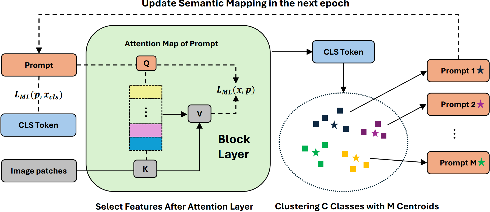

# DA-VPT: Semantic-Guided Visual Prompt Tuning

[](https://cvpr.thecvf.com/)
[](https://arxiv.org/pdf/2505.23694)
[](LICENSE)

Official PyTorch implementation of **Distribution Aware Visual Prompt Tuning (DA-VPT)**, accepted at CVPR 2025.

> **Note:** We apologize for the delayed release. Due to account access issues following graduation, the code release was postponed. We appreciate your patience and understanding.

---

## Abstract

Visual Prompt Tuning (VPT) has become a promising solution for Parameter-Efficient Fine-Tuning (PEFT) approach for Vision Transformer (ViT) models by partially fine-tuning learnable tokens while keeping most model parameters frozen. Recent research has explored modifying the connection structures of the prompts. However, the fundamental correlation and distribution between the prompts and image tokens remain unexplored. In this paper, we leverage metric learning techniques to investigate how the distribution of prompts affects fine-tuning performance. Specifically, we propose a novel framework, DA-VPT, to guide the distributions of the prompts by learning the distance metric from their class-related semantic data. Our method demonstrates that the prompts can serve as an effective bridge to share semantic information between image patches and the class token. We extensively evaluated our approach on popular benchmarks in both recognition and segmentation tasks. The results demonstrate that our approach enables more effective and efficient fine-tuning of ViT models by leveraging semantic information to guide the learning of the prompts, leading to improved performance on various downstream vision tasks.




## Installation

### Prerequisites

Install and create a conda environment from the [Anaconda Archive](https://repo.anaconda.com/archive/).

**Example installation:**

```bash
ANACONDA_VERSION="Anaconda3-2024.02-1-Linux-x86_64.sh"
ANACONDA_URL="https://repo.anaconda.com/archive/$ANACONDA_VERSION"
ENV_NAME="vpt"

wget $ANACONDA_URL -O ~/conda.sh --no-check-certificate

chmod a+x ./conda.sh

bash ~/conda.sh -b -p ~/anaconda3

export PATH="~/anaconda3/bin:$PATH"

source ~/anaconda3/bin/activate

~/anaconda3/bin/conda init bash

```

### Install Dependencies

```bash
cd DA-VPT
conda create --name $ENV_NAME python=3.10 -y

conda activate $ENV_NAME
conda update -n base -c defaults conda -y
conda install -y pytorch torchvision pytorch-cuda=12.1 -c pytorch -c nvidia

pip install ml-collections chardet
pip install timm matplotlib tqdm pandas seaborn scikit-learn scipy==1.13 simplejson termcolor
pip install ipdb pytest

# test if your installation is successful
python -c "import torch; print(torch.__version__)"
python -c "import timm; print("timm.__version__")"
python -c "import torchvision; print("torchvision.__version__")"
```

### Download Pre-trained Models

Download MoCo V3 pre-trained weights:

```bash
mkdir -p save
wget https://dl.fbaipublicfiles.com/moco-v3/vit-b-300ep/linear-vit-b-300ep.pth.tar -P ./save/
```

### Troubleshooting: MKL Error

If you encounter an MKL error such as:
```
site-packages/torch/lib/libtorch_cpu.so: undefined symbol: iJIT_NotifyEvent
```

Downgrade the MKL version:
```bash
conda install -y "mkl<2024.1"
```

Then reinstall a compatible numpy version:

```bash
pip install --force-reinstall numpy==1.23.0
```

## Dataset Preparation

For detailed instructions on downloading and preparing datasets, please refer to the original [VPT repository](https://github.com/KMnP/vpt).

**Requirements:**
- Image data
- JSON/TXT splitting files

**Expected directory structure:**
```bash
|-- vtab-1k
    |-- caltech101
    |   `-- images
    |       |-- test
    |       |-- train800
    |       |-- train800val200
    |       `-- val200
    |-- cifar
    |   `-- images
    |       |-- test
    |       |-- train800
    |       |-- train800val200
    |       `-- val200

......

|-- fgvc                                                 
|   |-- CARS196                                          
|   |   `-- car_ims                                      
|   |-- CUB200                                           
|   |   |-- attributes                                   
|   |   |-- images                                       
|   |   |   |-- 001.Black_footed_Albatross        
|   |   |   |-- 002.Laysan_Albatross

...

```

Move or create a symbolic link for the dataset to `DA-VPT/vpt_data`:

```bash
ln -s /path/to/your/datasets ./vpt_data
```

**Verify installation:**

```bash
python -m Dataset.VTAB_txt
python -m Dataset.FGVC_json
```

## Usage

### Training

To train the model with a specific configuration:

```bash
python train.py --config configs/fgvc/mae_cub200.yaml
```

### Evaluation

To evaluate a trained model:

```bash
python eval.py --model_path checkpoints/best_model.pth
```

## Results

Detailed results on VTAB-1k and FGVC benchmarks are available in the paper.

*Note: Full results will be updated soon.*


## Citation

```bibtex
@inproceedings{ren2025vpt,
  title={DA-VPT: Semantic-Guided Visual Prompt Tuning for Vision Transformers},
  author={Ren, Li and Chen, Chen and Wang, Liqiang and Hua, Kien},
  booktitle={Proceedings of the Computer Vision and Pattern Recognition Conference},
  pages={4353--4363},
  year={2025}
}
```

## License

This project is released under the [MIT License](LICENSE).

## Acknowledgments

We thank the authors of [VPT](https://github.com/KMnP/vpt) for their foundational work and code base.

## Contact

For questions or issues, please open an issue on GitHub or contact the authors through the paper correspondence.
